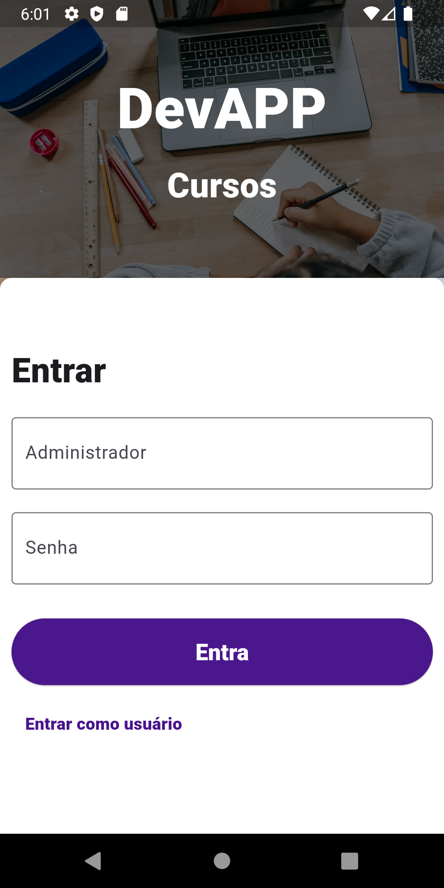

<h1 align="center">
 DevAPP Cursos
</h1>

<br>

<p align="center">
  
  
  
</p>

<br>

# Sobre o App

A ideia do aplicativo é o de uma plataforma de cursos. Nele, usuários podem se matricular em até 3 cursos, podendo também fazer alterações de seus dados. Para a inserção de novos cursos e exclusão de usuários, você deve ter um cadatro de administrador (username: `admin` password:`admin`). Usuários e administradores podem pesquisar por alunos na tela de alunos. Alguns recursos ficam privados a depender da forma de login, admins tem acesso a recursos que usuários básicos não têm.

<br>

# App Screens

<p align="center">
  
  
  
</p>
<p align="center">
  
  
  
</p>
<p align="center">
  
  
  
</p>
<p align="center">
  
  
  
</p>
<p align="center">
  
  
  
</p>

<br>

# Clone e execute

Para clonar e executar esse projeto você precisará do [Git][git] + [Dart][dart] + [Flutter][flutter] instalados no seu computador.

```bash
# Clone esse repositório
$ git clone https://github.com/LeandroSimo/course-app.git

# Entre no repositório
$ cd course-app.git

# Instale as dependências
$ flutter pub get

# Faça uma build do banco de dados
$ dart run build_runner build

# Execute
$ flutter run

```

<br>

<p style="font-size: 20px;">
      Antente-se em abrir o seu emulador ou conectar um device antes de rodar o projeto, pois o projeto está apenas com builds ios e android, ou rode o comando abaixo e gere uma build para o sistema que desejar:
</p>

```
$ flutter create --platforms <plataforma>
```

Subistitua o `plataforma` pelo sistema operacional desejado. Exemplo: `flutter create --platforms windows`

[git]: https://git-scm.com
[flutter]: https://flutter.dev/
[dart]: https://dart.dev/
